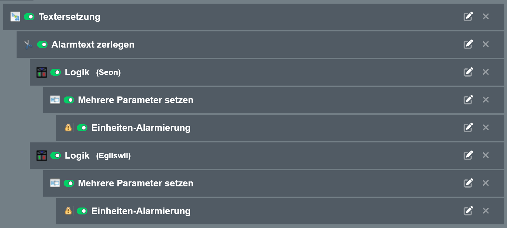

# alamos-scripts
Alamos Scripts, genutzt von der Feuerwehr Seon-Egliswil, mit Lodur / MoKoS

### convert_mannschaft.py
Wandelt den CSV-Export aus Lodur um, damit er in Alamos importiert werden kann  
Hilfsdateien: [example_mannschaftslisten.csv](example_mannschaftslisten.csv) (Input), [example_transformed_mannschaftslisten.csv](example_transformed_mannschaftslisten.csv) (Output)

### Einheitenkonfiguration Alamos
Es wird mit zwei Einheiten gearbeitet. Die erste (_SMS-Eingang_) verarbeitet das SMS, trennt die Bausteine des Texts und setzt die Standardfelder, und übergibt den Alarm an die zweite Einheit (_Alarmierung_).

#### SMS-Eingang:

Datei: [fe2_pipeline_sms_eingang.json](fe2_pipeline_sms_eingang.json)

##### Alarmierung:

Datei: [fe2_pipeline_alarmierung.json](fe2_pipeline_alarmierung.json)