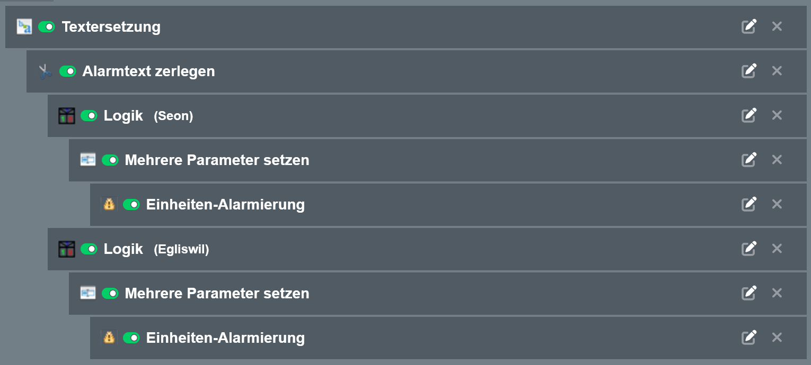

### MoKoS Alarm-SMS
Es wird mit zwei Einheiten gearbeitet. Die erste (_SMS-Eingang_) verarbeitet das SMS, trennt die Bausteine des Texts und setzt die Standardfelder, und übergibt den Alarm an die zweite Einheit (_Alarmierung_).

#### SMS-Eingang:

Datei: [einheit_sms_eingang.json](einheit_sms_eingang.json)

##### Alarmierung:

Datei: [einheit_alarmierung_sms.json](einheit_alarmierung_sms.json)
